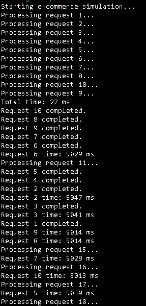
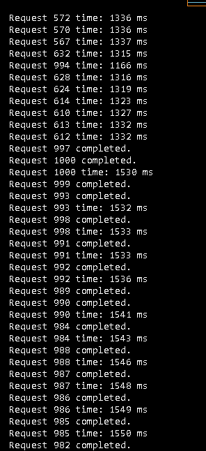

# Latency dan Slow Load

Tranksanksi 

# Daftar Isi
- [Pendahuluan](#pendahuluan)
- [Apa itu Latency dan Slow Load?](#apa-itu-latency-dan-slow-load)
- [ Metode apa yang Dapat Menyelesaikan Latency dan Slow Load?](#metode-yang-dapat-menyelesaikan-latency-dan-slow-load) 
- [Mengapa Mengatasi Latency dan Slow Load Penting?](#mengapa-mengatasi-latency-dan-slow-load-penting)
- [Flow Chart](#flow-chart)
- [Contoh Penyelesaian Latency dan Slow Load dalam Java](#contoh-penyelesaian-latency-dan-slow-load-dalam-java)
## Pendahuluan
Masalah latency dan slow load pada situs e-commerce dapat berdampak besar bagi perusahaan, baik dari segi pendapatan maupun kepuasan pelanggan. Misalnya, penelitian menunjukkan bahwa 47% pelanggan mengharapkan situs web e-commerce untuk memuat dalam waktu kurang dari dua detik. Jika memuat lebih dari tiga detik, 57% dari mereka akan meninggalkan situs, dan 80% dari mereka mungkin tidak akan kembali lagi. Dampak ini bisa mengakibatkan penurunan tingkat konversi hingga 7%, yang berarti potensi kerugian pendapatan hingga ribuan dolar per tahun bagi e-commerce dengan volume transaksi besar​

Sebuah contoh kasus nyata terjadi pada Amazon, yang mengalami downtime selama 40 menit pada tahun 2013 dan menyebabkan kerugian sekitar $5 juta. Kasus ini memperlihatkan betapa krusialnya optimasi performa situs dalam lingkungan e-commerce yang sangat kompetitif​(Realm Digital).Selain itu, salah satu penyebab utama latency adalah overload server, yang sering terjadi selama periode promo atau musim liburan ketika lonjakan lalu lintas online terjadi​

## Apa itu Latency dan Slow Load?

Latency adalah waktu tunda yang terjadi antara saat permintaan dikirim oleh pengguna hingga respons diterima dari server. Latency sering diukur dalam milidetik dan dipengaruhi oleh berbagai faktor seperti jarak fisik antara server dan pengguna, kecepatan jaringan, dan beban kerja server. Semakin tinggi latency, semakin lama waktu yang dibutuhkan untuk memuat data.


Slow load adalah masalah ketika sebuah situs web atau aplikasi membutuhkan waktu yang lama untuk memuat keseluruhan halaman atau elemen-elemen tertentu. Ini biasanya disebabkan oleh server yang overload, file yang terlalu besar, query database yang tidak efisien, atau infrastruktur jaringan yang kurang optimal. Slow load secara langsung mempengaruhi pengalaman pengguna dan dapat menyebabkan mereka meninggalkan situs.

### Metode yang Dapat Menyelesaikan Latency dan Slow Load
Pengurangan Waktu Tunda (Delay) = Mengurangi waktu tunda langsung yang diterapkan selama pemrosesan permintaan. Ini adalah pendekatan langsung untuk mengurangi latency dalam simulasi.
```java
Thread.sleep(1000); // Mengurangi waktu tunda dari 5 detik menjadi 1 detik
```
Caching = Caching menyimpan hasil dari permintaan sebelumnya untuk mempercepat akses jika permintaan yang sama datang kembali. Ini mengurangi waktu yang diperlukan untuk memproses permintaan yang sama di masa depan.
```java
 private static HashMap<Integer, String> cache = new HashMap<>(); // Simulasi cache

if (cache.containsKey(requestId)) {
    System.out.println("Request " + requestId + " served from cache.");
    return;
}
```
Thread Pool Dinamis = Menggunakan thread pool dinamis untuk mengelola thread secara efisien, memungkinkan aplikasi menangani banyak permintaan secara bersamaan dan mengurangi waktu tunggu.
```java
private static ExecutorService executorService = Executors.newCachedThreadPool();
```
Pemrosesan Asinkron = Memproses permintaan secara asinkron menggunakan CompletableFuture untuk memungkinkan pemrosesan paralel dan menghindari pemblokiran thread utama.
```java
CompletableFuture.runAsync(() -> handleRequest(requestId), executorService)
    .exceptionally(ex -> {
        System.out.println("Error handling request " + requestId + ": " + ex.getMessage());
        return null;
    });
```

### Mengapa Mengatasi Latency dan Slow Load Penting?
Pengalaman Pengguna: Latency tinggi atau load lambat bisa membuat pengguna frustasi dan meninggalkan transaksi, mengurangi kepuasan pelanggan.
Keandalan Sistem: Transaksi yang cepat dan responsif meningkatkan kepercayaan pengguna terhadap platform.
Skalabilitas: Mengurangi latency dan slow load membantu sistem menangani lebih banyak pengguna dan transaksi secara bersamaan.
Keamanan: Transaksi yang cepat dan efisien mengurangi risiko gagal bayar atau penipuan.
Efisiensi Operasional: Mengurangi waktu proses transaksi meningkatkan efisiensi server dan menurunkan biaya operasional.

# Flow Chart
Flowchart Program Solution


# Contoh Penyelesaian Latency dan Slow Load dalam Java
Misalkan ada 1000 Permintaan Request
```java
 private static final int MAX_REQUESTS = 1000; 
```
Contoh output program yang mengalami masalah latency dan slow load


Contoh output program yang menyelesaikan masalah latency dan slow load



# Reference
- [1] https://www.geeksforgeeks.org/java-thread-sleep-method/


