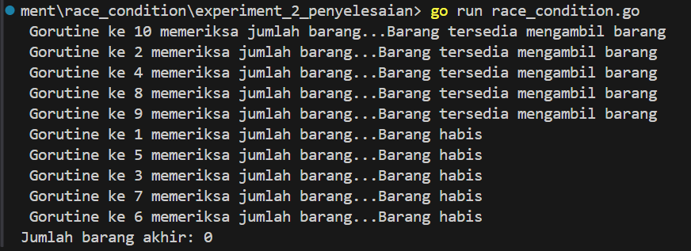
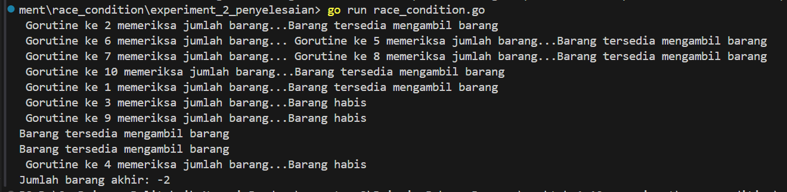

# README: Race Condition dan Double Spending

## Pendahuluan

Race condition adalah masalah yang terjadi ketika hasil dari suatu program bergantung pada urutan atau waktu kejadian tertentu yang berjalan bersamaan. Dalam konteks transaksi digital atau pengelolaan sumber daya, race condition dapat menyebabkan masalah serius seperti **double spending** atau kesalahan pengelolaan inventaris.


## Contoh Kasus: Mengambil Barang dengan Race Condition

Race condition bisa terjadi dalam berbagai situasi yang melibatkan pembelian barang secara bersamaan oleh banyak pengguna. Salah satu contoh yang umum adalah "stock availability" (ketersediaan stok) di mana beberapa pengguna mencoba membeli barang yang sama pada waktu yang bersamaan. Ini bisa menyebabkan masalah jika sistem tidak menangani akses ke data stok dengan benar.

* Skenario:

Ketersediaan Stok: Sebuah toko online memiliki 5 unit barang dalam stok.
Permintaan Pembelian: Pada saat yang sama, 10 pengguna mengakses halaman produk dan mencoba membeli barang yang sama.
Proses Pembelian: Setiap pengguna mengirimkan permintaan pembelian hampir bersamaan

### Kode Go untuk Mensimulasikan Race Condition

```go
package main

import (
    "fmt"
    "sync"
)

var barang = 5

func ambil_barang(wg *sync.WaitGroup, id int) {
    defer wg.Done()
    fmt.Printf(" Gorutine ke %d memeriksa jumlah barang...", id)
    if (barang <= 0) {
        fmt.Printf("Barang habis\n")
    }else{
        fmt.Printf("Barang tersedia mengambil barang \n")
        barang = barang - 1
    }
}

func main() {
    var wg sync.WaitGroup

    for i := 1; i <= 10; i++ {
        wg.Add(1)
        go ambil_barang(&wg, i)

    }
    wg.Wait() // menunggu proses gorutine selsesai
    fmt.Printf("Jumlah barang akhir: %d\n", barang)
}
```

Output:

<table> 
  <tr> 
    <td></td> 
    <td></td> 
  </tr> 
  <tr> 
    <td></td> 
    <td></td> 
  </tr> 
</table>

Dapat dilihat pada hasil output, ketika berhadapan dengan race condition, salah satu dampak yang bisa terlihat adalah hasil yang tidak konsisten atau bahkan tidak valid, seperti jumlah barang yang menjadi negatif.

## Penanganan Race Condition: Lock

Untuk menangani race condition pada kasus ini, kita bisa menggunakan mekanisme "check-and-set". Mekanisme ini memastikan bahwa sebelum mengambil barang, thread akan memeriksa jumlah barang yang ada, dan setelah proses pengambilan selesai, ia akan memverifikasi bahwa jumlah barang tidak berubah oleh thread lain selama proses berlangsung.

```go
package main

import (
    "fmt"
    "sync"
)

var barang = 5           // Jumlah barang yang tersedia
var mutex sync.Mutex     // Mutex untuk mengatur akses ke variabel barang

func ambil_barang(wg *sync.WaitGroup, id int) {
    defer wg.Done()

    fmt.Printf("Goroutine ke %d memeriksa jumlah barang...\n", id)

    mutex.Lock() // Mengunci sebelum mengakses variabel barang
    if barang <= 0 {
        fmt.Printf("Goroutine ke %d: Barang habis\n", id)
    } else {
        barang = barang - 1
        fmt.Printf("Goroutine ke %d: Barang tersedia, mengambil barang. Barang tersisa: %d\n", id, barang)
    }
    mutex.Unlock() // Membuka kunci setelah selesai mengakses variabel barang
}

func main() {
    var wg sync.WaitGroup

    for i := 1; i <= 10; i++ {
        wg.Add(1)
        go ambil_barang(&wg, i)
    }

    wg.Wait() // Menunggu semua goroutine selesai
    fmt.Printf("Jumlah barang akhir: %d\n", barang)
}

```

#### Mekanisme Pengecekan:

Untuk menangani race condition menggunakan lock, kita bisa menggunakan sync.Mutex dari paket standar Go. Mutex (singkatan dari mutual exclusion) memastikan bahwa hanya satu goroutine yang dapat mengakses bagian kritis kode pada satu waktu.

# Kesimpulan

Race condition dapat menyebabkan kesalahan seperti double spending dalam transaksi atau kesalahan pengelolaan sumber daya, seperti mengambil lebih banyak barang dari yang tersedia. Untuk menghindari masalah ini, Anda biasanya memerlukan mekanisme penguncian seperti mutex untuk memastikan bahwa hanya satu proses yang dapat mengakses atau memodifikasi data pada waktu tertentu namun tidak semua bahasa pemrograman mendukung fitur lock sehingga memaksa programmmer untuk melakukan pengecekan secara berkala untuk menghindari conflik.
