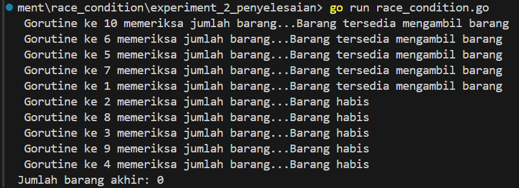
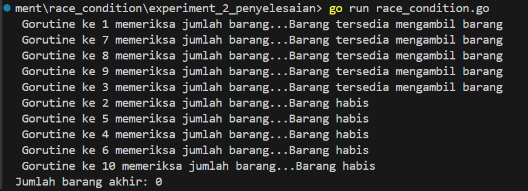
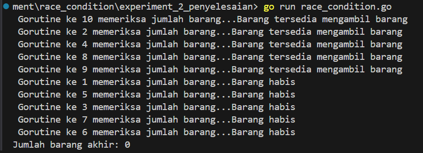
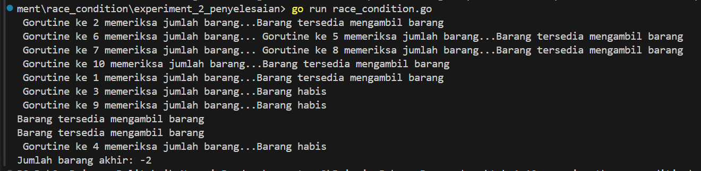

# Race Condition: Penjelasan, Implementasi, dan Penanganan

## Daftar Isi
- [Pendahuluan](#pendahuluan)
- [Apa itu Race Condition?](#apa-itu-race-condition)
  - [Contoh Situasi Race Condition](#contoh-situasi-race-condition)
  - [Mengapa Race Condition Berbahaya?](#mengapa-race-condition-berbahaya)
- [Contoh Implementasi Race Condition dalam Go](#contoh-implementasi-race-condition-dalam-go)
  - [Contoh Tanpa Concurrency Control](#contoh-tanpa-concurrency-control)
  - [Output yang Mungkin Terjadi](#output-yang-mungkin-terjadi)
  - [Contoh dengan Mutex untuk Menghindari Race Condition](#contoh-dengan-mutex-untuk-menghindari-race-condition)
- [Cara Penanganan Race Condition](#cara-penanganan-race-condition)
  - [Menggunakan Mutex](#menggunakan-mutex)
  - [Menggunakan Atomic Operations](#menggunakan-atomic-operations)
  - [Menggunakan Channel dalam Go](#optimistic-concurrency-control)
- [Kesimpulan](#kesimpulan)

## Pendahuluan

Race condition adalah masalah umum dalam pemrograman concurrent yang terjadi ketika hasil akhir dari program bergantung pada urutan atau timing dari eksekusi thread. Kondisi ini dapat menyebabkan perilaku tak terduga, yang sering kali sulit untuk di-debug.

## Apa itu Race Condition?

Race condition terjadi ketika dua atau lebih thread atau proses secara bersamaan mengakses dan memodifikasi shared resource tanpa adanya mekanisme sinkronisasi yang memadai. Hal ini menyebabkan urutan eksekusi yang tidak terprediksi, yang dapat menyebabkan bug atau hasil yang tidak diinginkan.

### Contoh Situasi Race Condition
1. **Double Spending:** Dalam aplikasi e-commerce, beberapa pengguna bisa membeli produk yang sama secara bersamaan, menyebabkan stok produk menjadi negatif.
2. **File Corruption:** Beberapa thread mencoba menulis ke file yang sama tanpa penguncian, menyebabkan file menjadi korup.
3. **Inconsistent Data:** Dua atau lebih thread membaca dan menulis ke variabel yang sama secara bersamaan, menghasilkan data yang tidak konsisten.

### Mengapa Race Condition Berbahaya?
- **Kesulitan Debugging:** Race condition sering kali sulit untuk direproduksi karena mereka bergantung pada urutan eksekusi yang tepat dari thread atau goroutine.
- **Hasil Tak Terduga:** Dapat menyebabkan data yang rusak, hasil yang tidak konsisten, atau bahkan crash aplikasi.
- **Masalah Keamanan:** Dalam beberapa kasus, race condition dapat dieksploitasi untuk tujuan jahat, seperti dalam kasus double spending pada transaksi keuangan.

## Contoh Implementasi Race Condition dalam Go

### Contoh Tanpa Concurrency Control
Berikut adalah contoh di mana race condition dapat terjadi karena banyak goroutine yang mencoba untuk mengurangi stok produk secara bersamaan tanpa ada pengendalian concurrency.

```go
package main

import (
	"fmt"
	"sync"
)

var barang = 5

func ambil_barang(wg *sync.WaitGroup, id int) {
	defer wg.Done()
	fmt.Printf(" Gorutine ke %d memeriksa jumlah barang...", id)
	if (barang <= 0) {
		fmt.Printf("Barang habis\n")
	}else{
		fmt.Printf("Barang tersedia mengambil barang \n")
		barang = barang - 1
	}
}

func main() {
	var wg sync.WaitGroup

	for i := 1; i <= 10; i++ {
		wg.Add(1)
		go ambil_barang(&wg, i)

	}
	wg.Wait() // menunggu proses gorutine selsesai
	fmt.Printf("Jumlah barang akhir: %d\n", barang)
}
```

Output:

<table> 
  <tr> 
    <td></td> 
    <td></td> 
  </tr> 
  <tr> 
    <td></td> 
    <td></td> 
  </tr> 
</table>

Dapat dilihat pada hasil output, ketika berhadapan dengan race condition, salah satu dampak yang bisa terlihat adalah hasil yang tidak konsisten atau bahkan tidak valid, seperti jumlah barang yang menjadi negatif.


# Navigasi ke Dokumen Lain

<style>
  .container {
    display: flex;
    justify-content: space-between;
    flex-wrap: nowrap;
    margin: 20px 0;
  }
  .box {
    background-color: #f2f2f2;
    border: 1px solid #ddd;
    border-radius: 8px;
    padding: 20px;
    width: 30%;
    text-align: center;
    box-shadow: 0 4px 8px rgba(0, 0, 0, 0.1);
    transition: background-color 0.3s, transform 0.3s;
    margin-right: 10px; /* Tambahkan jarak antar box */
  }
  .box:last-child {
    margin-right: 0; /* Hapus margin untuk kotak terakhir */
  }
  .box:hover {
    background-color: #e0e0e0;
    transform: scale(1.05);
  }
  .box a {
    text-decoration: none;
    color: #333;
    font-size: 18px;
    font-weight: bold;
  }
  .box a:hover {
    color: #007bff;
  }
</style>

<div class="container">
  <div class="box">
    <a href="/Double Spending/readme.md">Dokumen 1</a>
    <p>Deskripsi atau informasi tambahan tentang Dokumen 1.</p>
  </div>
  <div class="box">
    <a href="/File Corruption//readme.md">Dokumen 2</a>
    <p>Deskripsi atau informasi tambahan tentang Dokumen 2.</p>
  </div>
  <div class="box">
    <a href="/Inconsistent Data/readme.md">Dokumen 3</a>
    <p>Deskripsi atau informasi tambahan tentang Dokumen 3.</p>
  </div>
</div>


